# Relationship Graph: a guide for using it

The Relationship Graph draws one account as a picture: the company, the people
you deal with there, the deals in play, and which of your colleagues owns what.
It is there to answer questions a list of records answers slowly. Who else do we
know at this company? Who have we gone quiet on? Which deal is resting on a
single person?

You never draw or edit the graph. It is built from records your team already
keeps, every time you open it. Changing the graph means changing those records,
which is covered in [Changing what the graph shows](#changing-what-the-graph-shows).

Opening it never changes anything. It only reads.

---

## Contents

- [Opening the graph](#opening-the-graph)
- [Reading the graph](#reading-the-graph)
- [Looking at one record](#looking-at-one-record)
- [Moving around](#moving-around)
- [Changing what the graph shows](#changing-what-the-graph-shows)
- [A worked example](#a-worked-example)
- [When the graph surprises you](#when-the-graph-surprises-you)
- [Any company, not just one](#any-company-not-just-one)
- [Common questions](#common-questions)

---

## Opening the graph

Open any customer profile, from **Customers** or from a deal. The
**Relationship Graph** button sits at the top right of the profile.

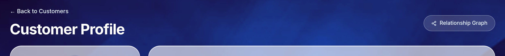

The graph opens over the profile. It does not navigate away, so closing it puts
you back exactly where you were.

To close it: press **Esc**, click the **×** at the top right, or click anywhere
outside the panel.

---

## Reading the graph

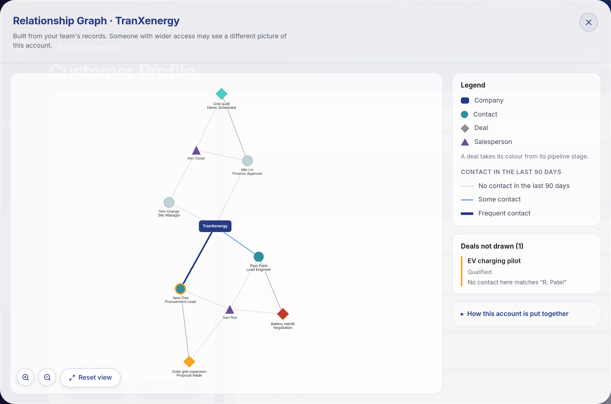

The title names the account. The line under it says whose records the picture
was built from, which matters when you compare notes with a colleague.

### The shapes

Every kind of record has its own shape as well as its own colour, so the graph
still reads if you print it in black and white or do not distinguish those
colours.

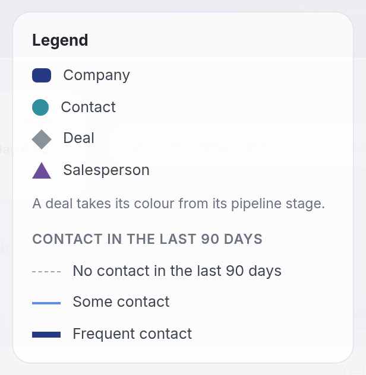

| Shape                        | What it is                                                                                 |
|------------------------------|--------------------------------------------------------------------------------------------|
| Rounded rectangle, dark blue | The **company**, at the centre of the account                                              |
| Circle, teal                 | A **contact**, someone at that company                                                     |
| Diamond                      | A **deal**. Its colour is its pipeline stage, the same colours as the Sales Pipeline board |
| Triangle, purple             | A **salesperson**, one of your colleagues                                                  |

The contact whose profile you opened carries an **orange ring**, so you can
always find your starting point.

### The lines

A line from the company to a contact shows how much contact there has been with
that person **in the last 90 days**:

| Line            | Meaning                                  |
|-----------------|------------------------------------------|
| Thick dark blue | Frequent contact, 5 or more interactions |
| Thin blue       | Some contact, 1 to 4 interactions        |
| Dashed grey     | No contact in the last 90 days           |

A dashed grey line is the one to look for. It marks someone on the account who
has gone quiet.

Faint lines also join deals to the contacts named on them, and salespeople to
the records they own or created.

---

## Looking at one record

### Hover for the numbers

Point at a contact, or at the line joining them to the company, to see their
activity without leaving the graph.

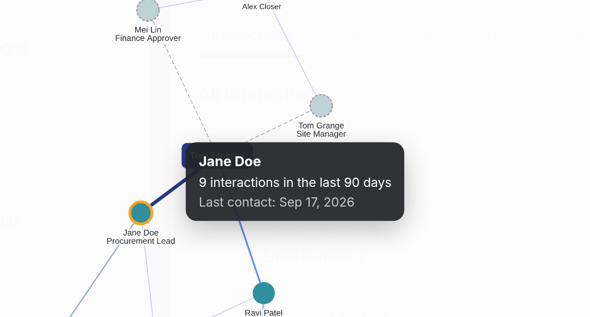

The count is the last 90 days only. The date is the last contact of any age, so
a contact can honestly read "0 interactions in the last 90 days" and still show
a date from months ago.

### Click to focus on one record

Click any node. It and everything it touches stay lit, and the rest of the
account dims, so what that record connects to is obvious at a glance.

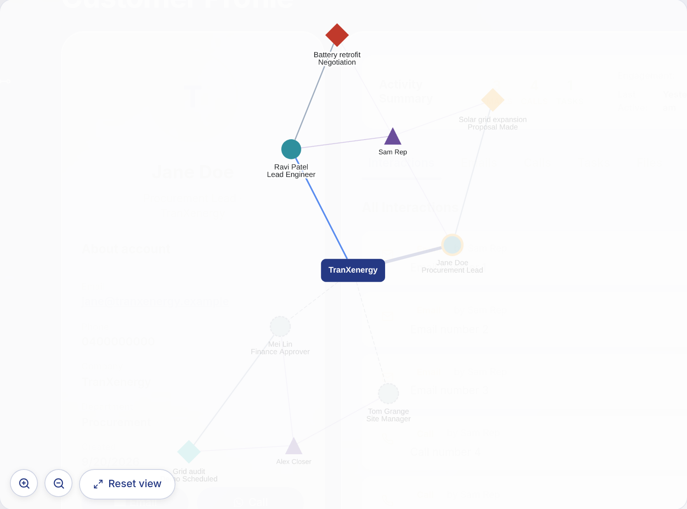

Details appear in a card at the top right.

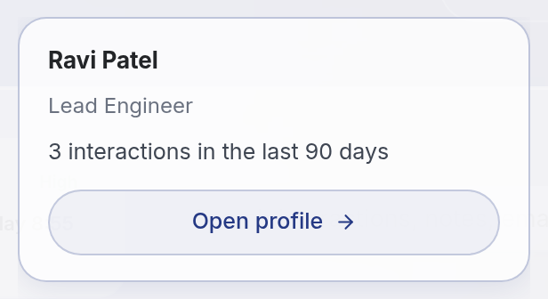

- For a **contact**, the card gives their job title, their 90-day activity, and
  an **Open profile** button.
- For a **deal**, the card gives its stage, how many of the contacts you can see
  it is drawn against, and an **Open in pipeline** button, which opens that deal
  on the Sales Pipeline board.
- For the **company** or a **salesperson**, the card says its connections are
  highlighted, which is the point of selecting it.

Opening a record closes the graph first, so the record is not hidden behind a
panel you then have to dismiss.

Click an empty part of the canvas to clear the selection.

---

## Moving around

The controls sit at the bottom left of the canvas.

- **Zoom in** and **zoom out** buttons, and the scroll wheel over the graph.
- **Drag** the background to pan, and drag a node to move it out of the way.
- **Reset view** returns to the framing the graph opened with and clears the
  selection.

---

## Changing what the graph shows

Nothing on the graph is maintained by hand, and there is nothing on it to edit.
Every node and every line comes from records your team already keeps. To change
the picture, change the record, then open the graph again.

| To see this                                                   | Do this                                                                                               |
|---------------------------------------------------------------|-------------------------------------------------------------------------------------------------------|
| A colleague of this contact appear on the account             | On their customer profile, set **Company** to the same company name                                   |
| Two accounts that should be one, merged                       | Correct **Company** on the profiles so the names match. Capitals and spaces at the ends do not matter |
| A thicker line to a contact                                   | Log interactions against their profile with **Log Interaction**                                       |
| A deal appear on the graph                                    | Create the deal with the account's company                                                            |
| A deal drawn against a person rather than listed as not drawn | Set the deal's **Customer** field to that contact's full name                                         |
| A salesperson appear                                          | They appear when they are the **Owner** of a contact, or created a deal, on this account              |

The graph is rebuilt on every open, so a change shows up the next time you open
it. There is no refresh to press and nothing to rebuild.

---

## A worked example

Take the account in the picture above. Reading it takes a few seconds and tells
you several things that a list of records would not.

**The relationship rests on one person.** Jane Doe has the only thick dark blue
line, and she is the only contact with frequent recent contact. If she leaves,
this account goes quiet.

**Two people have gone quiet.** Mei Lin and Tom Grange are joined by dashed grey
lines, so nothing has been logged with either in 90 days. Mei Lin is the
Finance Approver and Tom Grange is the Site Manager, which are not people to
lose touch with while deals are open.

**Three deals are live, at three different stages.** Their colours say so
without reading any labels: Battery retrofit in Negotiation, Solar grid
expansion at Proposal Made, Grid audit at Demo Scheduled.

**Each of those deals hangs off one contact.** Every deal has a single faint
line into a contact. Battery retrofit runs through Ravi Patel alone.

**A fourth deal is not on the graph at all**, and the rail says why. That is the
next section.

---

## When the graph surprises you

### "Deals not drawn"

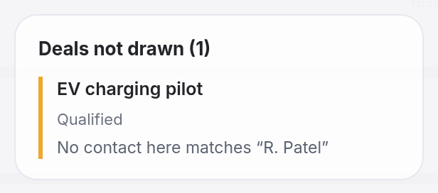

A deal is drawn against a contact when the deal's **Customer** field matches that
contact's full name. When nothing matches, the deal is listed here rather than
quietly left out, together with the name that was recorded on it.

Above, the deal says `R. Patel` while the contact is recorded as `Ravi Patel`.
Setting the deal's **Customer** field to the contact's full name puts it on the
graph.

### A company name spelled two ways makes two accounts

Contacts are grouped by the company recorded on their profile. Matching ignores
capitals and spaces at the ends, so `TranXenergy`, `tranxenergy` and
` TranXenergy ` are one account. Anything else is a different name:
`TranXenergy Pty` is a separate account from `TranXenergy`.

The panel explains this itself, under **How this account is put together**.

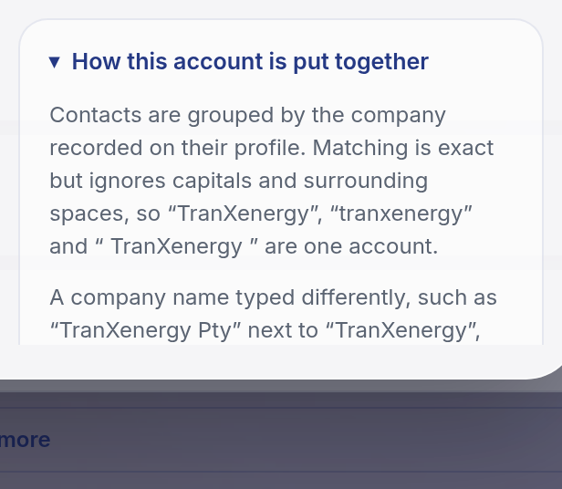

If an account looks half empty, this is the first thing to check. Correcting
**Company** on the profile merges it.

### A contact with no company

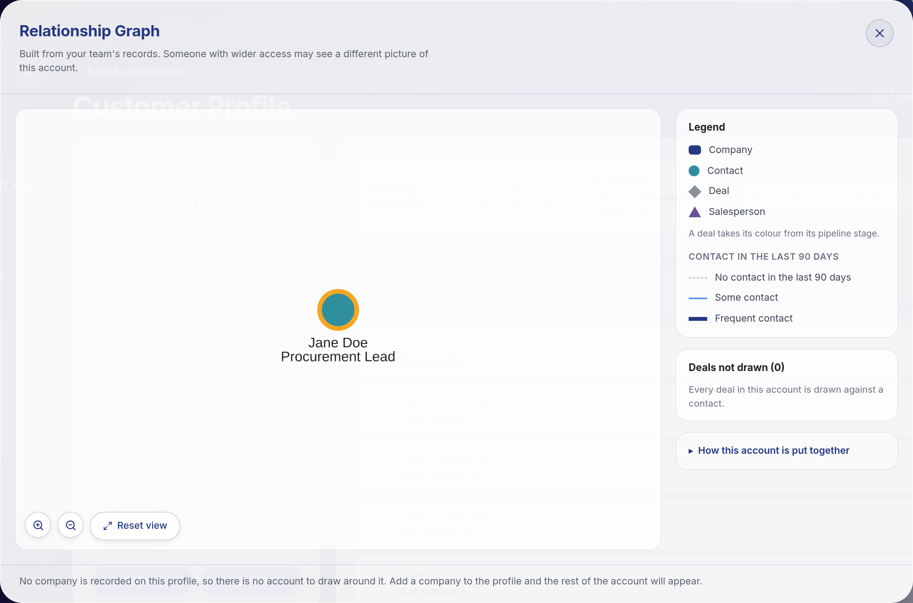

Without a company there is no account to draw around the person, so the graph
shows them alone and says so. Adding a company to the profile brings the rest of
the account in.

### A large account hides names until you look closer

On a big account, drawing every name at once produces a wall of overlapping
text. Past about 40 records the names are held back so the shape of the account
stays readable, and a note in the controls says so.

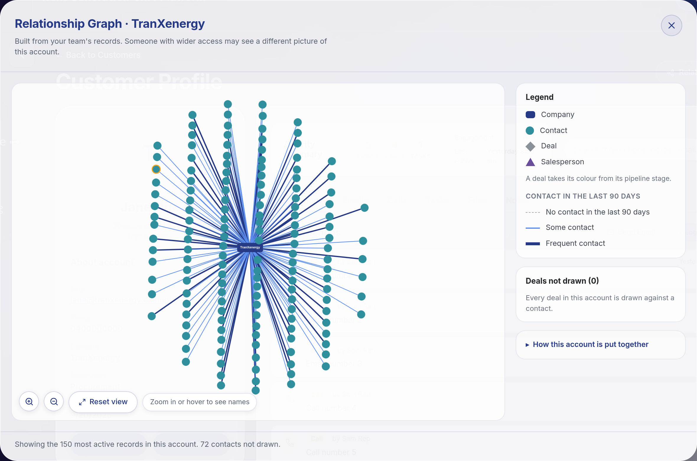

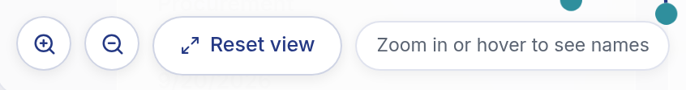

Zoom in, hover a node, or click one to read names again. The company keeps its
name throughout.

Very large accounts are also capped: the graph draws the 150 most active records
and the note at the bottom says how many were left out.

### Your colleague sees a different picture

The line under the title says whose records the graph was built from. The graph
only ever shows records you already have access to, so two people with different
permissions can open the same account and see a different picture of it. Neither
is wrong. If a contact or deal you expected is missing, it may be one you cannot
see rather than one that does not exist.

---

## Any company, not just one

The graph is not tied to any particular customer. Company names, contact names
and deal names in any script work the same way, including names with
apostrophes, ampersands and punctuation.

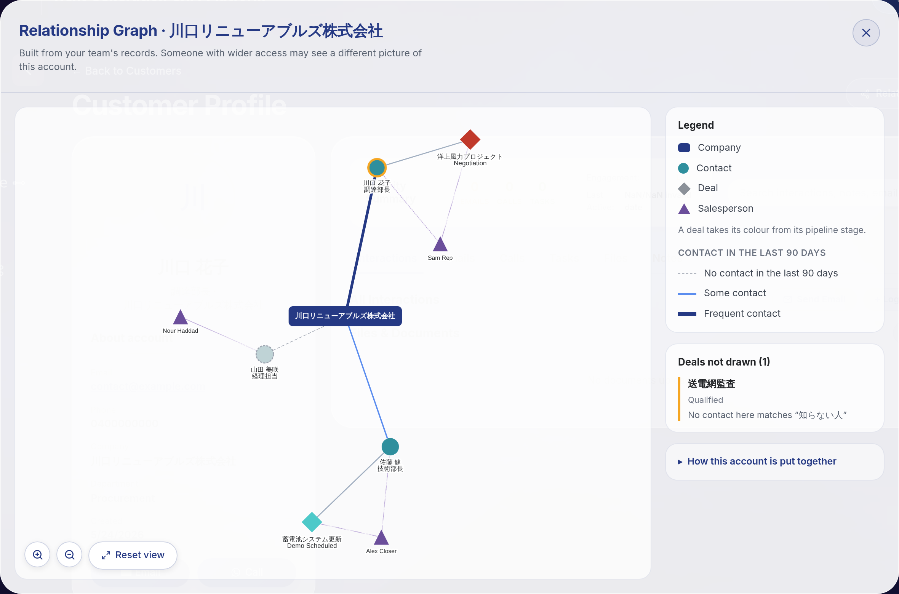

One limit is worth knowing: for a company name written outside the plain
A to Z alphabet, two spellings differing only in capitals may be treated as two
accounts rather than one. Names in scripts without capitals, such as Japanese or
Chinese, are unaffected. If you see this, spelling the company the same way on
each profile groups them.

---

## Common questions

**Does opening the graph change any data?**
No. It only reads. It never creates, edits or deletes a contact, deal or
interaction.

**How current is it?**
It is rebuilt from your records every time you open it. Log an interaction,
close the graph, open it again, and the new picture includes it.

**Why is a contact I know about missing?**
Either their profile records a different company name, or the record is one your
permissions do not cover. Check the **Company** field on their profile first.

**Why does one deal appear in the pipeline but not on the graph?**
Its **Customer** field does not match a contact on this account. Look at
**Deals not drawn** in the side rail, which names the deal and the name recorded
on it.

**What counts as an interaction?**
Anything logged against a contact's profile: a call, an email, a note or a task.
The graph counts those from the last 90 days.

**Can I use a keyboard to move around the graph?**
Not yet. The panel opens, closes and returns focus with the keyboard, and every
record drawn is listed in text for screen readers, but the graph itself cannot
be navigated by keyboard at the moment.

---

Building or changing the feature rather than using it?
[relationship-graph.md](relationship-graph.md) covers how it is put together.
